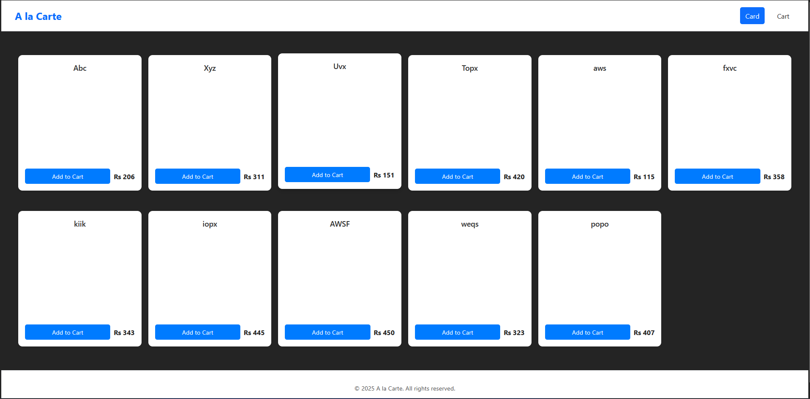
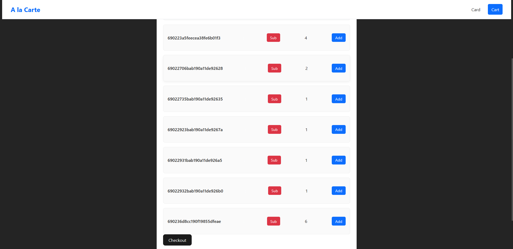
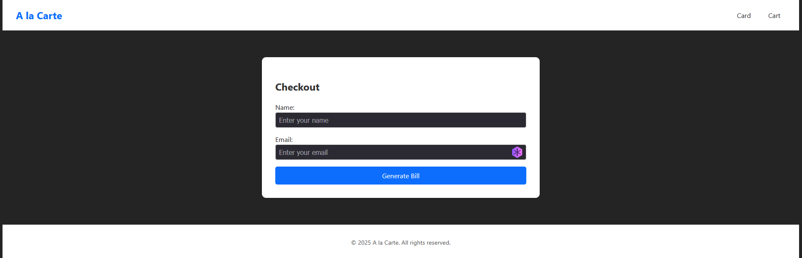
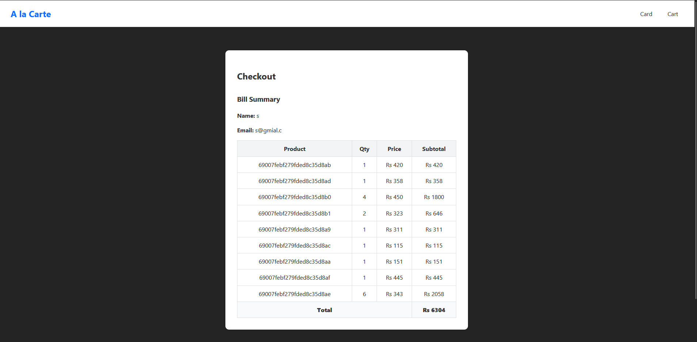

# Cart Application

A simple **MERN (MongoDB, Express, React, Node)** project that implements a shopping cart system using React’s **Context API + useReducer** for global state management and **Express Sessions** for backend cart persistence.

---

**Frontend:**

- React Router v6
- React Context API + `useReducer` for global cart store
- Fetch API for backend communication

**Backend:**

- [Express.js](https://expressjs.com/)
- [MongoDB](https://www.mongodb.com/)
- [Mongoose](https://mongoosejs.com/)
- [express-session](https://www.npmjs.com/package/express-session) for unique session handling
- REST API routes for cart and checkout management

---

## Setup Instructions

### Prerequisites

Make sure you have the following installed:

- **Node.js** (>= 18)
- **npm** or **yarn**
- **MongoDB** running locally (default port `27017`)

---

### 1. Clone the Repository

```bash
git clone https://github.com/lnxbsh/ecom.git
cd ecom
```

### Start the backend services

```
cd backend
npm install
npm start
http://localhost:5000

```

### Start the fronted services

```
cd frontend
npm install
npm run dev
http://localhost:5173
```


Home screen that appears after the frontend loads


Cart Screen appear after selecting item from prev screen namely card


Checkout screen where use enter contact information for bill generation


Bill Generation Screen

### Working of Frontend

- The frontend uses useReducer and useContext to manage a global cart store.

- Products can be added, removed, and their quantities updated.

- The cart context is shared across pages using a global <CartProvider />.

- When checking out, the frontend calls the backend /api/checkout endpoint with user details (name, email).

### Working of backend

- Each user session is tracked using express-session, ensuring a unique cartId for every visitor.

- Cart items are stored in MongoDB based on sessionID.

- On checkout, a new Checkout document is created in MongoDB, containing the cart, user info, and session ID.

### Implementated

- Cart management (add/update) implemented using React context.
- Session handling implemented using express-session.

- Checkout API route implemented on the backend (/api/checkout).

- Checkout Page and Bill generation.

- Backend ready for future expansion (user authentication, product management, etc.).

### Pending Implemenation

- User feedback system for action perform.
- Delete Feature.
- Cart Flush.
- Some functionality need modification to stop re render and single click response.
- Cart Removal After bill generation.
- Reimplemenation context api with state management lib.
